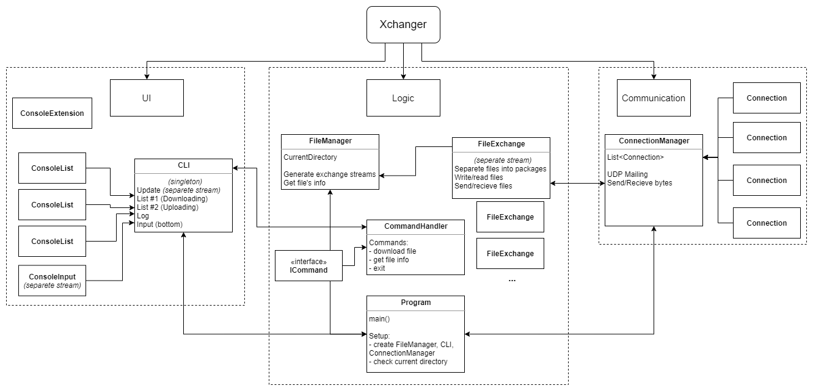

# Technical Documentation

In general, program consist of 3 parts: UI, Communication and Exchange Logic.

## UI

Main classes:
* **CLI** *(singleton)* - main UI class, other parts communicate with UI through it *(seperate stream)*.
* **ConsoleExtension** - a few methods for extending basic console class.
* **ConsoleList** - providing output of list of elements.
* **ConsoleInput** - advanced console input *(seperate stream)*.

## Communication

Main classes:
* **Connection** - providing TCP connection between two programs;
* **ConnectionManager** - handling all income and outcome connections.

## Exchange Logic

Main classes:
* *[MAIN]* **Program** - start program.
* **FileManager** - handle file writing&reading.
* **ICommand** - interface for input commands.
* **CommandHandler** - handle input commands.
* **FileExchange** - class for sending/recieving certain file *(seperate stream)*.
